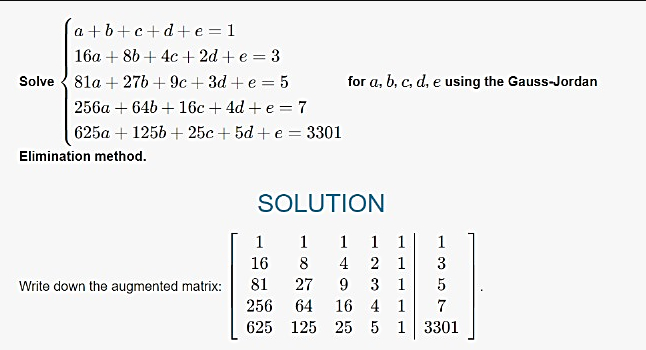

+++
title = 'Math Break'
date = '2024-10-12'
authors = ["Yukash"]
+++

# Math Break

## Part 1 Description:
```
Math break !!
1 , 3 , 5 , 7 , ... ?
What number will be next?
(Don't trust the numbers on internet. Trust the numbers which we have)
```

This part is a viral math meme. Even if you don't have any idea about the meme, a quick google search will give you the picture of what number would be next.

   

From the image, we can see that the number can be arbitrary (as shown in the image using polynomial interpolation). But the description says "Trust the number which we have". The only number that we have is 3301 , and we conclude that the missing number is 3301. 

```
Get the Map to the place which the numbers corresponds 
```

This statement implies us to get the graph/plot of the function the numbers correspond to

Now using these 5 values, just as how the image has a polynomial function constructed, we also construct a polynomial function. Set up the linear equations and solve them using an online solver




## Part 2 Description:
```
View with from a place where you can just see the 150s of x and y.
Hear the valleys and the mountains. Hear the roots of the trees.
What do they say? Don't care about the octave.
Once you feel them perfectly, you'll get the answer...
```

Once we plot the function, we have valleys(minima) , mountains(maxima) and roots. If you use [desmos](https://www.desmos.com/calculator), you might know that desmos has a functionality to hear the graphs.
If we search about how the musical notes are correlated, we can find that the notes made by the desmos graphs are 
1.  dependent on the points we choose(which is by default, the maxima , minima and the roots of the polynomial)
1.  dependent on where you look the graph from.


So, if we notice, the first line asks us to view it from 150s of x and y. So we set the visible region from -150 <= x <= 150 and -150 <= y <= 150.

Now we have the proper setup to hear the notes. We can use any notes detector app to get the musical notes at each point. With enough patience, we can see that the notes correspond to A#4 , F4 , A#4 ,C#4 ,A#1 , F4 , A#4 
```
Don't care about the octave
```
explicitly asks us not to worry about the octave and just take the notes.

So, from desmos we get the following musical notes put together as A#FA#C#A#FA# .
Use the decoder given (decoder.exe) to decode this and get the flag.

```
$ ./decoder.exe
Enter the string to be decoded(without spaces):
A#FA#C#A#FA#
Decoding..

Decoded message: cyber3301{osint_ez}

Hope this is correct
```
