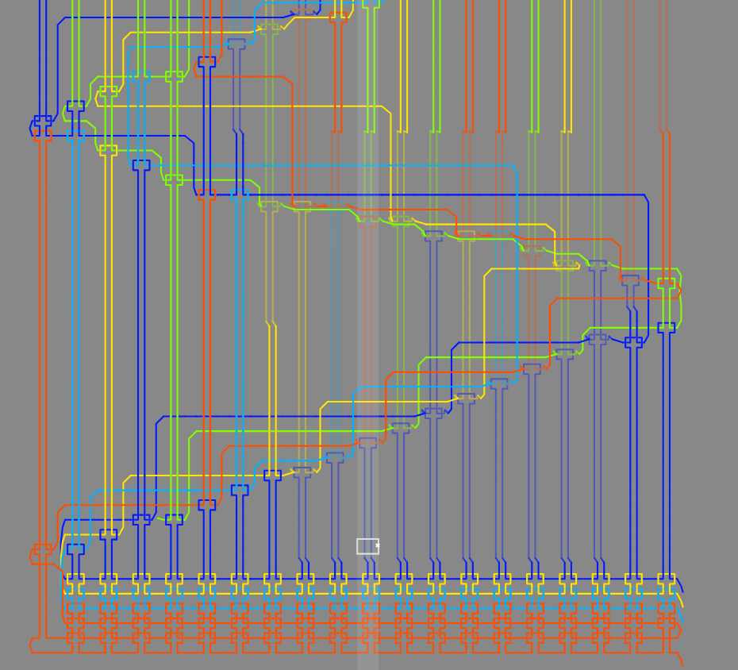

+++
title = "Knitted Flag"
date = 2026-06-13
authors = ["Krishith V"]
+++

> I got a new knitting machine to help me with the tablecloths for the restaurant but I accidentally dropped my flag into it. Can you help me unravel it?
### Handout
[pattern.k](attachments/pattern.k)

---

# Solution
## Understanding the file
We are provided the file `pattern.k`. Opening this file we can see it is filled with commands like inhook, tuck, knit and xfer. I had never seen the file extension `.k` so on googling we can find something about a Knitout language. This was it, because it followed the same instruction set and the challenge description also hints at something about knitting.

Now that we know the language, the next step was to visualise it. I searched for a Knitout visualiser and found this [website](https://textiles-lab.github.io/knitout-live-visualizer/). However putting the file in the visualiser just gives us some random pattern like this:


## Analysing the patterns
Looking more carefully at the pattern and `pattern.k`, three things caught my eye:
- Each row is exactly 20 needles wide. 
- Every place where the row changes, the needle direction changes (from + to - or vice versa).
- In some rows, the needle is on the back bed instead of the front bed. If we only look at the bed of each `knit` commands

```
knit - b20 3
knit - b19 3
knit - f18 1
knit - f17 5
knit - f16 5
knit - f15 1
knit - f14 3
knit - f13 1
```
For example in this snippet, the bed sequence is "bbffffff".

The last point intrigued me because it could be used to represent a grid of pixels where f and b can be used to represent pixels in a row and everytime the direction of the needle changes a new row is created.

## Parsing the data
To test this out, I made the following program where we save the bed and needle information onto a row, and append that row when the direction changes. Do note that I could've used the `xfer` command to find where the bed switches, parsing the `knit` commands was easier because it explicitly states the bed every time so we can keep track of it. 


```python
data = []
current_row = []
previous_direction = '-'
with open('pattern.k') as f:
    for line in f:
        line = line.strip()
        
        operation = line.split(' ')
        #We will skip all the other commands other than knit
        if operation[0] != "knit":
            continue

        if operation[1] != previous_direction:
            # If the direction changes, we will append the current_row to data and create a new "row"
            data.append("".join(current_row))
            current_row = []
            
        current_row.append(operation[2])
        previous_direction = operation[1]
```

## Converting the data to an image
Now we can convert this `data` array to an image. The following code first creates a plain white image of `width=30` (We are setting this width manually, because although `len(data[0]) + 1` works (`+1` is there because needle number goes to 20 but the coordinates are 0 indexed), the pixels sit right at the border with no padding) and `height=len(data)`. Whenever the back bed is used, we calculate the needle number and set that pixel to the colour black.

```python
from PIL import Image

width = 30
height = len(data)

img = Image.new("RGB", (width, height), "white")
pixels = img.load()

for y, row in enumerate(data):
    for char in row:
        if char[0] == "b":
            needle = int(char[1:])
            pixels[needle, y] = (0, 0, 0)

img.save("flag.png")
```

Combining all the code snippets and rotating the final image by 90 degrees:


The final script is [here](attachments/solve.py)

## Final flag
`GPNCTF{coN6ra7ULATioNS_Y0u_Hav3_uNDERstOOd_kNiT0U7_4nD_UnRAvE1ED_th3_T4bl3clo7hS}`
