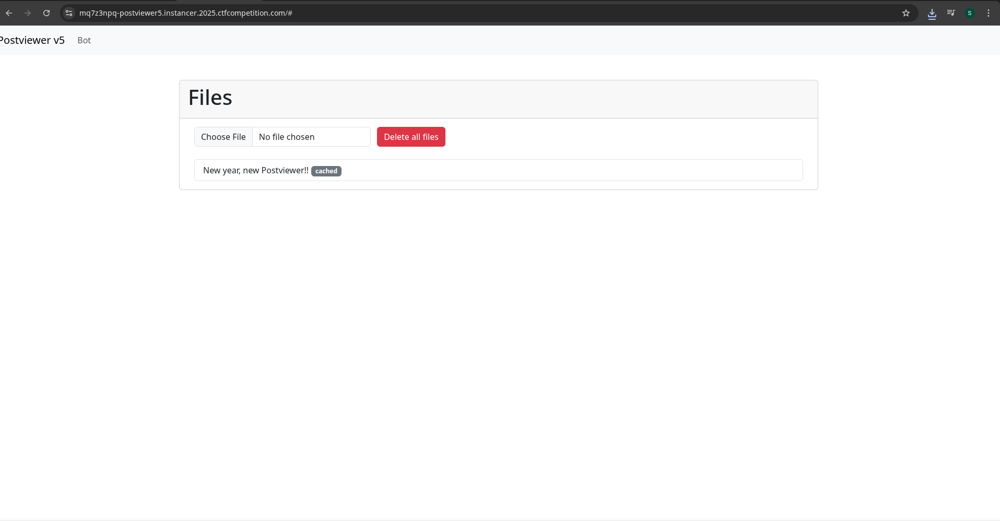
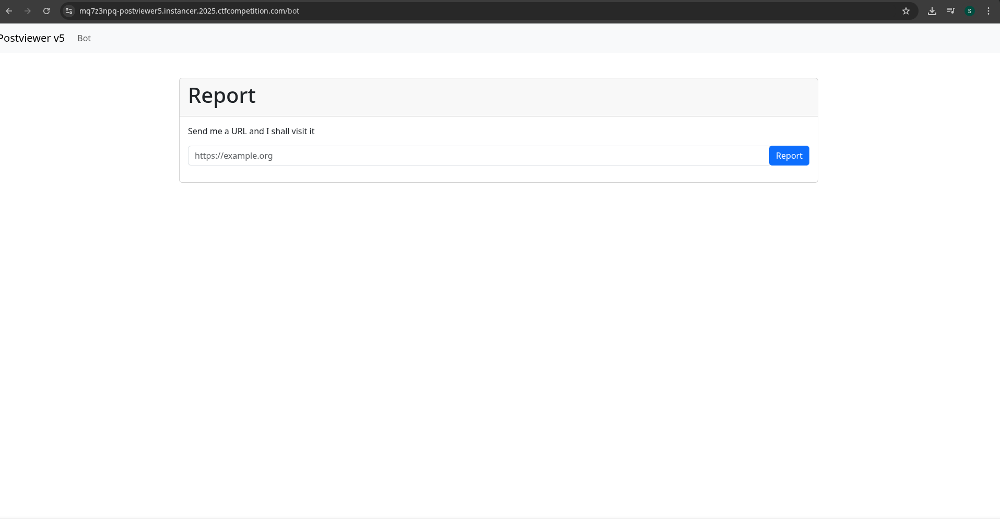
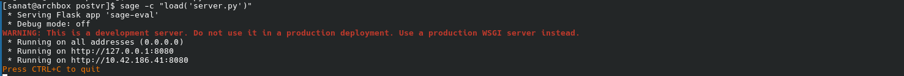
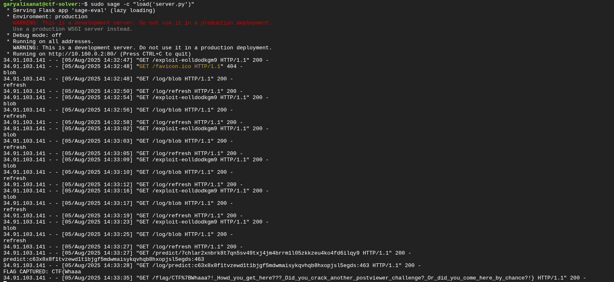

+++
title = "POSTVIEWER"
date = 2025-08-11
authors = ["Sanat Garyali"]
+++

# POSTVIEWER v5² WRITEUP 
---

## Introduction

This year’s **Postviewer** in Google CTF was a SafeContentFrame (SCF) playground ,a client-side puzzle where files render on a sandbox origin instead of your app’s origin. Only **2 solves**. It’s intentionally evil: the fix is simple, the race is not.


---


### 1) Upload & store (IndexedDB)

Files (cached or non-cached) are stored client-side with metadata:

```js
async addFile({ id, file, cached, isPublic}) {
  const db = await this.dbPromise;
  const tx = db.transaction(["files", "info"], "readwrite");
  const filesdb = tx.objectStore("files");
  const infodb = tx.objectStore("info");

  const req = filesdb.put({ id, file, cached, isPublic });
  return new Promise((resolve) => {
    req.onsuccess = () => {
      const fileInfo = { id, name: file.name, cached, isPublic, date: Date.now() };
      const req2 = infodb.put(fileInfo);
      req2.onsuccess = () => resolve(fileInfo);
    };
  });
}
```
<figure style="text-align:center; margin:1.25rem 0;">
  
</figure>


### 2) Render pipeline (SCF URL + shim)

Selecting a file (click or `#<N>` deep-link) kicks off the SCF flow. The app computes a hash from product + salt + origin, base36’d and fixed-width, to build the **shim URL**:

```js
async function calculateHash(...parts) {
  const encoder = new TextEncoder();
  const newParts = [];
  for (let i = 0; i < parts.length; i++) {
    const part = parts[i];
    newParts.push(typeof part === "string" ? encoder.encode(part).buffer : part);
    if (i < parts.length - 1) newParts.push(encoder.encode("$@#|").buffer);
  }
  const buffer = concatBuffers(...newParts);
  const hash = await crypto.subtle.digest("SHA-256", buffer);
  return arrayToBase36(new Uint8Array(hash)).padStart(50, "0").slice(0, 50);
}

const product = "google-ctf";
const hash = await calculateHash(product, salt, window.origin);
const url = `https://${hash}-h748636364.scf.usercontent.goog/${product}/shim.html`;
```

Then the parent creates/points the iframe and **attaches `onload` before the load completes**:

```js
safeFrameIframe.addEventListener("load", safeFrameLoaded, true);
safeFrameIframe.src = url; // shim.html on SCF
```

### 3) Parent ⇄ Shim handshake (normal)

On **LOAD(shim)** the parent posts the file over:

```js
safeFrameIframe.contentWindow.postMessage(
  { body, mimeType, salt },
  url.origin,
  [messageChannel.port2]
);
```

Shim verifies **origin+salt** and replies with **"Reloading iframe"**; parent removes the handler and shim swaps itself for the blob file:

```js
if (e.data.message == "Reloading iframe") {
  safeFrameIframe.removeEventListener("load", safeFrameLoaded, true);
  resolve();
}
```

### 4) Cached vs Non-cached salts

* **Cached**: `salt = encode(file.name)` (deterministic per filename).
* **Non-cached**: `salt = getRandom(5)` → 5 draws of `Math.random()` → base36 chunk per draw → concatenated.

```js
function getRandom(n) {
  return Array.from(Array(n), Math.random)
    .map(e => e.toString(36).slice(2))
    .join('');
}

async function renderFile({ id, cached, file }, safeFrameIframe) {
  let salt;
  const encoder = new TextEncoder();
  if (cached) {
    salt = encoder.encode(id).buffer; // filename-based
  } else {
    const rand = getRandom(5); // 5 chunks from Math.random()
    mathRandomInvocations.push(rand);
    salt = encoder.encode(rand).buffer;
  }
  return window.safeFrameRender({
    body: await file.arrayBuffer(), mimeType: file.type, salt, cached
  }, safeFrameIframe);
}
```

### 5) `#<N>` deep-link 

The app can auto-open a file at load if the URL ends in `#<index>`.

---

## Bot behavior (context)

1. Bot opens the app (localhost), adds a **non-cached** file containing the **plaintext flag**.
2. Bot visits our supplied URL (our exploit page).
3. After \~5 minutes, the bot closes the browser.

So when our exploit runs, the **flag file already exists** in IndexedDB, and its **salt path is driven by `Math.random()`**.

---

<figure style="text-align:center; margin:1.25rem 0;">
  
</figure>

## The Race Condition 

> TL;DR: We want the **parent** to send `{…, salt}` **twice**; the second send must land while **our leaker** is already the iframe document, and **before** the parent processes the shim’s ACK (which would remove the handler).

### Normal cycle (why leakage *doesn’t* happen by default)

```
APP: attach onload → iframe.src = SHIM
SHIM loads → LOAD fires → APP → SHIM: {body, mimeType, salt}
SHIM verifies → posts ACK → APP removes onload
SHIM replaces itself with blob(file) (file now runs) → but APP won’t send again
```

**Why no leak:** the send happens before our doc ever runs; after ACK, onload is gone.

### Exploit vision

We need **one more LOAD** to be **handled before** the ACK. That makes APP re-run the onload handler and resend the salt into **whatever** is currently inside the iframe → **our leaker**.

### Two-cycle plan (Shim₁ + Shim₂)

**Cycle A (cached, Shim₁ → Navigator)**

* Share **cached Navigator** (a file that self-navigates).
* Shim₁ verifies → posts ACK → (parent not stalled yet) processes it immediately → removes *that cycle’s* onload.
* Shim₁ swaps to **Navigator**, which starts **renavigating** (e.g., via `setTimeout(()=>location=blob(...),150)`). Each navigation will produce a **future iframe LOAD** — these are our “extra tickets.” They exist independent of the cached-cycle handler (which is already removed).

**Cycle B (non-cached, Shim₂ → Leaker)**

* Start a new cycle by sharing **non-cached Leaker**. Fresh **onload handler attached** for this cycle.
* On **LOAD(Shim₂)**, APP sends `{…, salt_real}` (first send; verification).
* **Freeze the parent** (CPU-burn gadget) so **ACK from Shim₂ is queued but unprocessed**. Meanwhile:

  * Shim₂ swaps to **Leaker** (our script with `onmessage=e=>leak(e.data.salt)`).
  * Separately, a **Navigator-driven navigation** completes, which will result in a **new LOAD** destined for the parent.
* **Unfreeze** the parent → queued tasks drain. With tuning:

  1. **LOAD** (from Navigator) fires **before** the **ACK**.
  2. APP’s onload handler runs **again** and **re-sends `{…, salt_real}`**, now into **Leaker**, which grabs and exfiltrates it.
  3. Only after that does the **ACK** run and remove the handler. Race won.

### Why stalling works

* The iframe lives in a separate process; it can continue completing navigations while the parent is blocked.
* We use the built-in slow gadgets:

```js
// provided by the challenge (intended/unintended gadgets)
window.onmessage = async function(e){
  if(e.data.type == 'share'){
    // can loop absurd amounts: {file:{length:1e8}}
    for (var i = 0; i < e.data.files.length; i++) { /* burn */ }
  }
  if(e.data.slow){
    for (i = e.data.slow; i--; );
  }
}
```

### Navigator & Leaker

```html
<!-- Navigator (cached) → keeps re-navigating -->
<script>
setTimeout(() => {
  location = URL.createObjectURL(
    new Blob([document.documentElement.innerHTML], {type: 'text/html'})
  );
}, 150);
</script>
```

```html
<!-- Leaker (non-cached) → catch the resend -->
<script>
onmessage = e => leak(e.data.salt);
</script>
```

### handler timing

* **Loads only help if the onload handler is attached at that moment.**
* Cached cycle: ACK processed immediately → handler gone → Navigator’s initial loads are ignored by the parent (but they still *happen*, which is important).
* Non-cached cycle: fresh handler attached; we **delay** its ACK; now a Navigator load fires while handler is **still attached** → second send happens.

---

## After the leak: PRNG → XSS pivot → flag

Once we have **one** non-cached salt, the rest is deterministic engineering.

### 1) Split the salt into 5 base36 chunks

The non-cached salt is the concatenation of 5 `Math.random()` outputs in base36. E.g.

```js
salt = r1.toString(36).slice(2)
     + r2.toString(36).slice(2)
     + r3.toString(36).slice(2)
     + r4.toString(36).slice(2)
     + r5.toString(36).slice(2);
```

Chunk lengths vary (\~10–12 chars). Recovering them is a small search:

* Try plausible 5-way splits (start with 11/11/11/11/11, adjust ±1 where needed).
* Convert base36 chunk → float in `[0,1)` approximation.
* Check if a consistent JS-PRNG progression fits those 5 outputs (don’t over-explain engine specifics; we just verify consistency and move forward).

Outcome: **five consecutive PRNG outputs** recovered.

### 2) Recover PRNG state & predict forward

With several consecutive outputs, you can reconstruct the PRNG’s state and produce **future** `Math.random()` values on demand. End product: a `nextRandom()` you control.

### 3) Hunt a **short** predicted salt (< 51 chars total)

We need a predicted concatenation `S* = s1+s2+s3+s4+s5` whose **total length < 51**. Iterate `nextRandom()` 5-at-a-time until such a concatenation appears.

### 4) Craft a **cached XSS** pinned to that salt

* Create a **cached** file whose **filename = `S*`** and whose **content hash is shorter than the filename length** so the app uses **filename-as-salt** (not the hash).
* Rendering this cached file now fixes the SCF origin to the one derived from `S*` - same origin your future non-cached flag render will use when the PRNG lands on `S*`.

### 5) Keep a handle to the SCF doc

The app hides the SCF iframe behind a `shadowRoot`. From your XSS, **open** or **navigate** to that exact SCF URL and **store a reference** so you can still talk to it later:

```js
const scfUrl = makeScfUrlFromSalt(Sstar);
const w = window.open(scfUrl, "scfS"); // or keep a ref after location.replace
// later: w.document.body.textContent → same-origin DOM read
```

### 6) Burn salts until the next non-cached = `S*`

Each non-cached render consumes **5** PRNG draws. Force the app to render dummy non-cached files to advance in steps of 5 until the predictor says the **next** salt will be `S*`.

### 7) Render the **flag** file

Trigger the app to render the real flag file. Its non-cached salt equals `S*` now → it loads on **the same SCF origin** as your cached XSS payload.

### 8) Same-origin = victory


## End-to-end playbook-recapped

1. Share cached **Navigator**; let it start looping navigations (extra LOADs exist now).
2. Start non-cached **Leaker**; fresh onload attached; first send verifies.
3. **Stall** parent; ACK delayed; iframe swaps to **Leaker**.
4. **Unstall**; a queued **LOAD** fires **before** ACK → parent re-sends salt → **Leaker** leaks.
5. **Split** leaked salt → recover PRNG → **predict** forward.
6. Find **short** predicted salt `<51` → craft **cached XSS** with `filename=S*` and body-hash shorter than filename.
7. **Store handle** to `SCF(S*)` document.
8. **Burn** PRNG outputs (dummy non-cached renders) until next non-cached salt = `S*`.
9. Render **flag** → now on same SCF origin as our XSS → **read & exfil**.


## Environment 

I was using Arch which gave me 2 separate headaches:

* **Networking:** bot can’t hit private LAN IPs
* **Dependencies:** Arch + pip + sagemath created conflict hell.

Fix: spin a tiny **Ubuntu 22.04** VM on Goggle Cloud with a **public IP**, open HTTP.

<figure style="text-align:center; margin:1.25rem 0;">
  
</figure> 

### Flag:

<figure style="text-align:center; margin:1.25rem 0;">
  
</figure>
```
