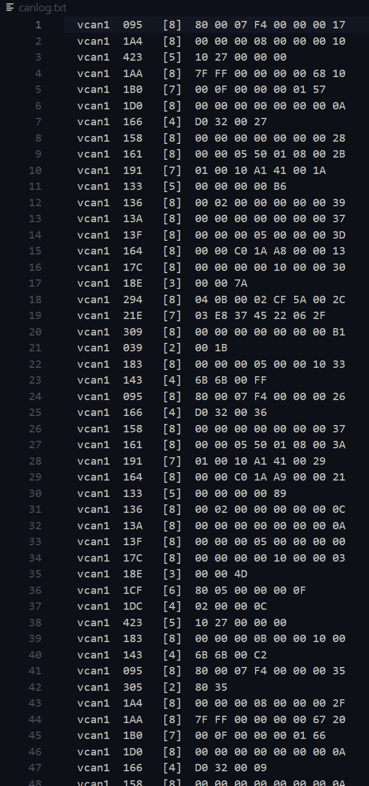
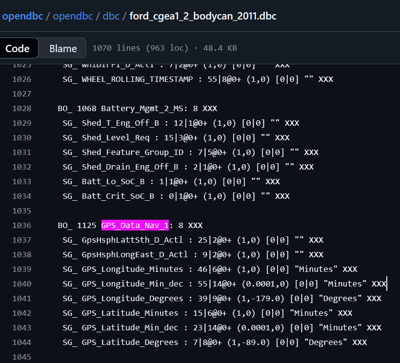
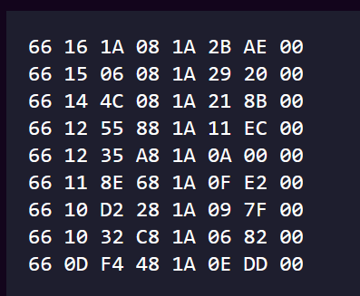

+++
title = "Lost In Madras"
date = 2025-07-08
authors = ["Aditya Sharma"]
+++

### Description

I recently visited Madras... and I got carjacker T-T

Luckily, I had a wireless OBD adapter connected to my car through which I was able to obtain the CAN log for the whole journey. It's so unfortunate that I cant make sense of the log.

1. To confirm that it's mine, find the VIN for my car.
2. Also, can you help me find where my car ended up?

Flag format: bi0s{VIN_Landmark Name}

along with the challenge, you're given a 37 MB canlog.txt file.

### Preface


This is what canlog.txt looks like, for 956236 lines.

with entries of the format:
`vcan0/1/2 { message identifier (hexadecimal) } { length of message } { message }`

the message itself has its bytes separated using a whitespace as a delimiter, no message exceeds 8 bytes in length.

### The VIN

my solution here is very blind to the way CAN logs function, my solution somewhat assumes that if a message has to be broken into several packets, the bytes from those packets form a contiguous message with no other messages in between

```python
import re

def parse_log_iso_tp(file_path):
    isotp_sessions = {}
    
    with open(file_path, 'r') as file:
        for line in file:
            match = re.match(r'\s*vcan\d+\s+([0-9A-Fa-f]+)\s+\[\d+\]\s+((?:[0-9A-Fa-f]{2}\s+)+)', line)
            
            if not match:
                continue
            can_id = match.group(1).upper()
            data = [int(byte, 16) for byte in match.group(2).strip().split()]
            pci = data[0]
            if pci >> 4 == 1:  # First frame (0x1X)
                total_length = ((pci & 0xF) << 8) + data[1]
                payload = data[3:]  # Skip PCI and 2 bytes header
                isotp_sessions[can_id] = {
                    'expected_len': total_length,
                    'payload': payload,
                    'next_seq': 1
                }
            elif pci >> 4 == 2 and can_id in isotp_sessions:  # Consecutive frame
                seq = pci & 0xF
                session = isotp_sessions[can_id]
                if seq == session['next_seq']:
                    session['payload'].extend(data[1:])  # skip PCI
                    session['next_seq'] = (session['next_seq'] + 1) % 0x10


    # Decode VIN-like strings
    found = False
    for can_id, session in isotp_sessions.items():
        try:
            ascii_data = ''.join(chr(b) for b in session['payload'] if 32 <= b <= 126)
            vin_match = re.search(r'\b[A-HJ-NPR-Z0-9]{17}\b', ascii_data)
            if vin_match:
                print(f"✅ VIN found from CAN ID {can_id}: {vin_match.group()}")
                found = True
        except:
            continue
    if not found:
        print("❌ No VIN found in ISO-TP messages.")
# Usage

parse_log_iso_tp("canlog.txt")
```

this is a script that someone from my team prompt-engineered out of an LLM.

the way this works is it takes the message data from the canlog and matches it against a regex which checks for the format of a VIN.

fortunately this worked out for us and gave us the VIN.

### Frequency analysis


the images above are graphed "unique call frequency" versus "vcan ID" and "gross call frequency" versus "vcan ID"

unfortunately we messed up here because we weren't actually able to identify any leads to go further.

The idea was that GPS data would be very frequent and very different, so analysis of unique messages should give us narrowed down can ids to further run checks on, but alas.

### The part we didn't get

The intended continuation from after getting the VIN is finding out what vehicle this VIN belonged to. The problem we faced was that we had no idea that this VIN was valid and associated with a real world car. If we had looked into what vehicle this VIN identified, using something like
[this decoder](https://vpic.nhtsa.dot.gov/decoder/)

The thing about CAN IDs is that they're very proprietary, but there's this thing known as a DBC, which maps CAN ids to what they represent,

<https://www.csselectronics.com/pages/uds-protocol-tutorial-unified-diagnostic-services>

<https://github.com/commaai/opendbc>



here the number 1125 is just decimal for hex 0x465, which is associated with GPS data

there are also GPS_Data_NAV_2 and 3, however the CAN IDs associated with them do no occur in the canlog.

after this its rather simple.



the python-can library provides pretty good resources to parse this automatically.

```zsh
pip install 
```

```python
#!/usr/bin/env python3

"""

ford_gps_decode.py

––––––––––––––––––

Reads a candump-style log and prints latitude/longitude every time the

Ford GPS broadcast (CAN ID 0x465) appears.

  

Usage examples

  cat canlog.txt | python ford_gps_decode.py

  python ford_gps_decode.py canlog.txt

"""

import argparse, re, sys, json

GPS_ID = 0x465                                    # Ford “GPS_Data_Nav_1” frame[1]

  

# ------- low-level decoder (replicates fordcan.py’s hard-coded lambdas) --------

def decode_gps(payload: bytes):

    """Return (lat, lon) in decimal degrees from the eight-byte GPS frame."""

    if len(payload) != 8:

        return None

  

    value = int.from_bytes(payload, byteorder="big")

  

    # latitude ‑- 28 bits: 8° / 6′ / 14 ×0.0001′  (offset −89)[1][2]

    lat_raw  = (value >> 36) & ((1 << 28) - 1)

    lat_deg  =  (lat_raw >> 20) & 0xFF

    lat_min  =  (lat_raw >> 14) & 0x3F

    lat_frac =   lat_raw         & 0x3FFF

  

    # longitude ‑- 29 bits: 9° / 6′ / 14 ×0.0001′  (offset −179)[1][2]

    lon_raw  = (value >> 7) & ((1 << 29) - 1)

    lon_deg  =  (lon_raw >> 20) & 0x1FF

    lon_min  =  (lon_raw >> 14) & 0x3F

    lon_frac =   lon_raw         & 0x3FFF

  

    lat = -89  + (lat_deg + (lat_min + lat_frac * 0.0001) / 60)

    lon = -179 + (lon_deg + (lon_min + lon_frac * 0.0001) / 60)

    return round(lat, 6), round(lon, 6)

  

# -------------------------- log-line parser ------------------------------------

CANDUMP = re.compile(

    r"\b([0-9A-Fa-f]{3,8})\b"      # arbitration ID

    r"\s+\[(\d)\]\s+"              # DLC

    r"((?:[0-9A-Fa-f]{2}\s*){1,8})"  # payload

)

  

def parse_line(line: str):

    m = CANDUMP.search(line)

    if not m:
        return None

    arb_id = int(m.group(1), 16)
    dlc    = int(m.group(2))
    data   = bytes.fromhex(m.group(3))
    return arb_id, data[:dlc]
    
# ----------------------------- main loop ---------------------------------------

def main():

    ap = argparse.ArgumentParser(description="Extract Ford GPS messages (ID 0x465)")
    ap.add_argument("logfile", nargs="?", help="candump text file (default: stdin)")
    args = ap.parse_args()
    src = open(args.logfile, "r") if args.logfile else sys.stdin
    for ln in src:
        parsed = parse_line(ln)
        if not parsed:
            continue
        arb_id, data = parsed
        if arb_id == GPS_ID:
            coords = decode_gps(data)
            if coords:
                print(json.dumps({"lat": coords[0], "lon": coords[1]}))

if __name__ == "__main__":
    main()
```

```zsh
(CTF) ➜  lost-in-madras python ford_gps_decode.py canlog.txt
{"lat": 13.09768, "lon": 80.2933}
{"lat": 13.09032, "lon": 80.29112}
{"lat": 13.08536, "lon": 80.28465}
{"lat": 13.0826, "lon": 80.28196}
{"lat": 13.08175, "lon": 80.2752}
{"lat": 13.07729, "lon": 80.28022}
{"lat": 13.07227, "lon": 80.27477}
{"lat": 13.06802, "lon": 80.27222}
{"lat": 13.06334, "lon": 80.27935}
```

the script above uses the same parsing as fordcan.py found in the library I mentioned

take the last few GPS data logs and you'll see that they point to M. A. Chidambaram International Cricket Stadium

The flag is:
`bi0s{1FMHK7D82BGA34954_M. A. Chidambaram Stadium}`

# Post-face??

[Valgrind's Writeup](https://www.valgrindc.tf/posts/madras/) took a lower-level approach to decoding the GPS data, but I don't particularly like their approach with how they found and decoded it. However their method for finding the VIN is far superior to the one I tried.

In the end they got the flag and we didn't, so make of that what you will.
