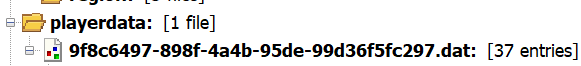
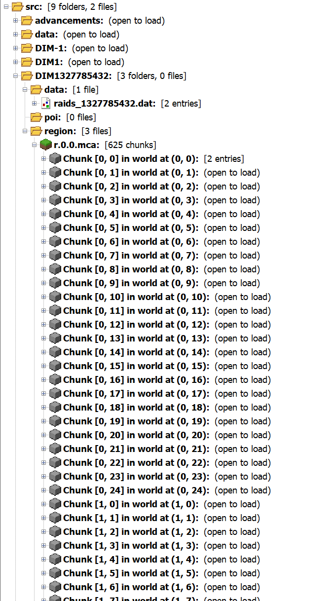
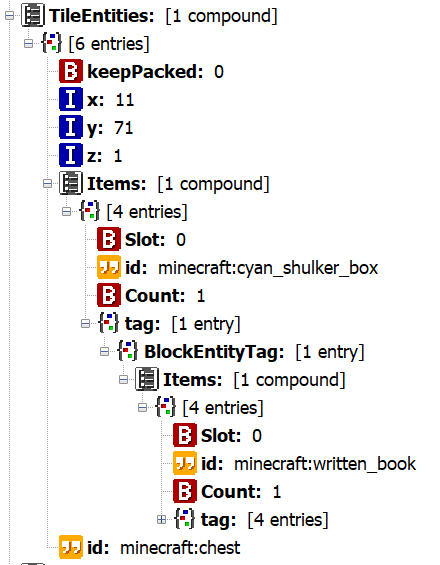

+++
title = "MineWorlds"
date = 2025-07-07
authors = ["Aditya Sharma"]
+++

# The Question

you're given a handout which contains a minecraft world folder (for the minecraft infinite dimensions april fools snapshot), and you're given the IP of a minecraft server to connect to, which is the same world, hosted on bi0s' servers (with some changes maybe)

# Prerequisite

you need to either have a minecraft, or find a way to run minecraft without having a valid account *wink*

# Crawling

The first step I took was joining the world, since the world was goofy, the first things i tried were going to the end and the nether and seeing if something was off, then i tried doing some other stuff which didnt work (which included going to other dimensions by tossing books into nether portals)

then i joined their server (which couldn't stay up for more than 10 minutes goddammit) which at first, made me download a server resource pack, at first this didnt seem *too* suspicious

then i roamed around to no avail for around an hour

# The Intended Solution

## Analysing the Handout

When you open the handout, you see this

If you are familiar with what save files look like, or just generate a new world and look at what it looks like, you'll see that this `DIM1327785432` directory is out-of-place.

so this is what we'll focus on later.

before delving deeper into this directory in particular, i'll walk you around this save file and what all it stores

This is what a world generated in this snapshot looks like by default, before you generate any new *DIM*ensions


we'll skim through these one by one

- **advancements**
 used to keep track of the achievements of the player
- **data**
 Stores miscellaneous world data, such as maps, custom structures, and world-specific data packs.
- **datapacks**  
 Holds data packs that modify or add to the game's mechanics for this world only.
- **DIM1**  
 Contains all region files and data for The End dimension.
- **DIM-1**  
 Contains all region files and data for The Nether dimension.
- **playerdata**  
 Stores individual player data files (one per player, named by their UUID), including inventory, position, health, and more.
- **region**  
 Holds the main Overworld region files, which store the actual chunk data for the world.
- **serverconfig**  
 Contains server-specific configuration files for this world, used mainly in modded Minecraft or with certain server setups.
- **stats**  
 Stores files tracking each player's statistics, such as blocks mined, distance traveled, etc.
- **icon**  
 A PNG image file representing the world in the Minecraft world selection menu.
- **level.dat**  
 The main world data file, containing global world information such as game rules, world seed, and player data.
- **level.dat_old**  
 A backup of the previous level.dat file, used for recovery in case of corruption.
- **session.lock**  
 A file used to prevent multiple instances of Minecraft from accessing the world at the same time, helping to avoid data corruption.

With this tiny bit of exposition it should be obvious that the DIM folder contains data about the new dimension that they made and sent, let's open it and see its contents.


we come across this goofy file format that i've never seen before, so i do a little bit of digging on DAT (which seemed like data files) and MCA files

**MCA Files**

- MCA files are "Anvil region" files used by Minecraft to store the terrain and chunk data of a world
- Each MCA file represents a 32x32 chunk regions, where each chunk is a 16x16 block area of the world
- The files are named based on their region coordinates (e.g., `r.0.0.mca`), and are located in the `region` folders for the Overworld, Nether (`DIM-1`), and End (`DIM1`)
- MCA files use a compressed binary format (NBT - Named Binary Tag) to efficiently store block, entity, and other chunk-specific data

**DAT Files**

- DAT files are generic data files used by Minecraft to store various types of information, all encoded in the NBT (Named Binary Tag) format

It seems that this NBT format is of use to us, now we look for software which lets us view/edit these files

a quick search lands on upon NBTExplorer or NBT Studio (i recommend NBT Studio, because it's more up to date and doesnt crash when using find ffs)

## NBT Studio


`this is the same handout, opened in NBT Studio`

If you're following along on your own, you'll be able to click around on the folders and search for parameters, as someone who enjoys both playing minecraft and fiddling with files just going in and looking at stuff for around 10 minutes was pretty exciting.


this random string is some form of hash of the player's username, i think this changes to your mojang user-id if you have an authenticated session or use the official launcher or something im not sure

This is supposedly the creator of the world, we can look at the stuff in their inventory, and their enderchest and how hungry they are and what dimension they're in and what their position is.

while all of this is cool and things like their position etc. are possible routes to go down (i.e. go to the exact position as the creator and see if they left something) but this isn't where the challenge leads

screw this, lets look at the new dimension instead

holy hell

thats a lot of entries, which probably came from the intial loading or so of the new dimension

but if there is anything we want to find here, we're gonna want to know what to look for, so what i tried first was a minecraft book, the reason for this being that in this snapshot, you have to toss a written book into a nether portal, things about that book are hashed together into a number (which I think is the number which comes after DIM) so "if i know exactly what book i have to toss into the portal to enter that dimension, maybe i can do the same in the server", we'll see that this was both a really good guess, and also somewhat misguided (but a good starting place nonetheless)


hey! theres a written book in a shulker box in that dimension, this has very obviously been planted there by the creator


this is a more elegant way of getting the information in the book, 
you have to go to the position 11 71 1 on the server, in this dimension, for the next hint.

this is where the intended method and my method diverge, we'll continue with the intended solution.

## goofing for an hour on the server

if you tried to teleport to the dimension on your instance of the world with the handout (before

- you would notice that after typing a '/' in chat (which is what all commands in minecraft start with) the autocomplete gives you a couple of commands.
- The thing is that by default, minecraft doesnt have any commands available to a non-operator player on a server or offline. Which means that these commands were made available to you on purpose, the most interesting one of these is /warp

/warp teleports you to a dimension which it calculates by taking a hash of the string you put in after it

so the next step is:

- calculating a hash collision which gives you the dimension that you need to go to
- joining the server
- warping to the dimension on the server by using /warp \<calculated hash for warp>
- flying to the coordinates

- you get this riddle, solving for the riddle narrows down to basalt (is supposed to narrow down, as someone who has been playing minecraft for a while and knows a most of the interactions and "features" of the game, this definitely did not point to basalt)
- you bring out basalt blocks from your creative inventory, place them down
- realise that the polished basalt block has a texture on it which is a QR code
- the pastebin it takes you to contains "Wait is this being downloaded on my system?", and a password

# fleg

- This "riddle" more unambiguously than the last, points to the resourcepack that the server made you download when you first joined it
- and when you open it; indeed, there is a fleg.zip file present, which you can simply unzip with the password which will give you the flag

`flag:bi0sctf{ch1ck3n_j0ckey_m1ght_b3_my_0nly_fr13nd}`

# my "solution"

**The actual writeup has ended, what follows are two methods of attack which involve identity theft and breaking cryptography respectively, read on if you want**

now i wasn't able to solve the challenge during the competition, but when i did see the solution i realised that two of my methods shoudl've worked

now lets go back to the part where your're supposed to go to that dimension on the server. I just didnt realise that the warp command existed, so i didnt know of having to compute that hash collision or anything of the sort

I, in my infinite genius, realised that maybe the guy who made the challenge, left some sort of information, and to get it you have to log in as him

- this is very straightforward on an "offline-mode = true" server, because the only thing that the server authenticates against is your username, so logging in as the setter is as easy as logging in as "Sky", so i make a new account with the name Sky and log in, and i get

This in and of itself is pretty bloody genius, this was a pretty big stroke of luck, but i did get the riddle and that got me excited.

now the riddle itself is pretty bad, i disliked it, I wasn't able to solve it.

BUT

This doesn't stop you from getting the QR in other ways


looking at the dates modified of the assets shows one of them modified at a time other than what the others have been, this points to that asset being something to do with the challenge

# zipcrypto

while solving, I got stuck in a rabbit hole, I thought that the challenge's last part was actually a zip file cracking task.

[bkcrack, a zipcrypto cracking utility][https://github.com/kimci86/bkcrack]

while i was learning how a password protected zip file could be cracked, i found out about a vulnerability in a now-discontinued zip file locking method called zipcrypto.

```
bkcrack -L <zipfile name>
```

this gets you information about the file encryption

if you run it on this zip file you can see that its been "encrypted" with zipcrypto

then by knowing at least; 8 contiguous bytes and 12 total bytes in an encrypted file you want to crack open, let the thing do its magic

this didnt work very well because while i knew at least 8 contiguous bytes; "bi0sctf{" I lacked the remaining 3 bytes which i wouldve needed to crack the file properly

i did consider guessing something like "bi0sctf{ch1c" for the known plaintext which in hindsight wouldve been bloody genius, but alas.

